# Alona Makarov

### AI & Automation | Business Process Automation

Building practical AI/automation systems with n8n, Airtable, APIs and AI agents.

20 years background in accounting.

**Focus:** accounting automation, operational workflows and SMB solutions.

---

## How I Think

I start by mapping real operational workflows to identify where automation
creates value and where human judgment must remain.

- **Focus on what costs money:** I target manual handoffs, bottlenecks, and
  failure points that cause real business losses.
- **No invented data:** if a fact isn't verified, the system never treats it
  as true.
- **Every automation needs a fallback path:** explicit error handling and a
  clear way for a human to step in.

---

## Project

### Clinic Operations Automation

A full lead-to-appointment automation system covering lead intake, client
management, booking, reminders, customer support, and failure recovery.

Built solo the complete system: workflow architecture, website, admin
application, CRM structure, n8n automations, RAG customer-service assistant,
reliability mechanisms, and access controls.

---

## Key Features

- **Reliable lead capture** — validates, normalizes, and retries failed
  submissions. Three layers, one purpose: no client submission can silently
  disappear.
- **Multiple contact paths** — website form, website chatbot, WhatsApp Business.
- **Direct booking** — visitors can book an appointment directly through the
  clinic's Google Calendar booking page.
- **AI chat widget** that answers only from approved clinic content, and guides
  visitors toward self-service booking.
- **Admin dashboard** — manages leads, clients, and appointments in one private,
  password-protected app.
- **Automated reminders** — sent the day before every appointment, with
  self-service confirm / cancel / reschedule links.
- **Calendar sync** — keeps Google Calendar and CRM appointment data aligned.
- **Error handling** — retries failed workflows and escalates unresolved issues
  to a person.

---

## Architecture

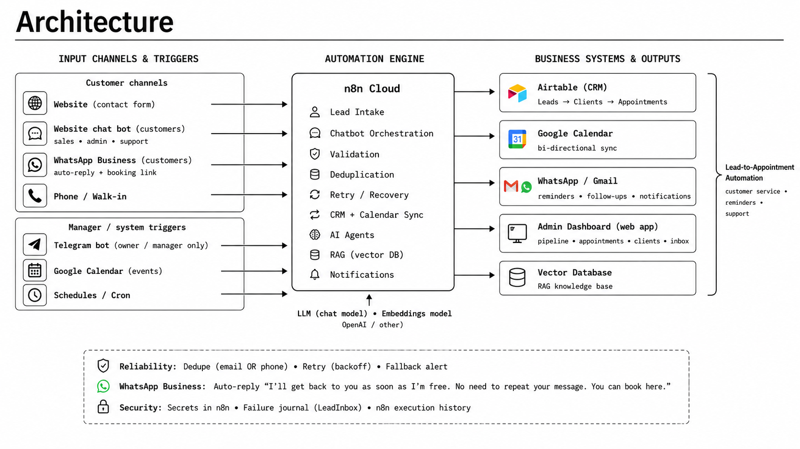

---

## The Automations

| # | Workflow | Trigger | What it does |
|---|---|---|---|
| 1 | Leads Intake | Website form | Validates, normalizes, responds instantly instead of making the client wait for the save to finish, and journals every submission to a backup log. |
| 1b | Lead Inbox Retry | Every 10 minutes | Retries failed lead writes and escalates after 12 attempts. After ~2 hours of failed attempts, emails a person to enter it by hand. |
| 1c | Save Lead | Called by 1 / 1b | The only place a lead is actually written. Dedupes by phone or email within 48 hours; links to an existing client on match. |
| 4 | Error Handler | Any automation fails | Catches failures from other workflows so nothing fails silently. |
| 5 | Calendar Sync | Calendar event created / updated / cancelled | Keeps the CRM in sync with Google Calendar automatically. |
| 6 | App Gateway | Admin app books / changes / cancels | The admin app's single door to the calendar and database; also converts a lead into a full client record. |
| 7 | Customer Service Chat | Chat widget used | RAG-based customer support. Answers only from approved content; guides visitors toward self-service booking. |
| 8 | Knowledge Base Ingest | Run manually on content change | Loads approved clinic content into the chatbot's memory. |
| 9 | Appointment Reminders | Daily at 9:00 | Sends a day-before reminder with confirm / cancel / reschedule links. |
| 10 | Manager Agent | Private Telegram bot | Owner-only assistant. |

---

## Integrations

| Service | Role |
|---|---|
| n8n Cloud | Orchestrates every automation |
| Airtable | CRM — leads, clients, appointments |
| Google Calendar API | Source of truth for appointment time |
| Gmail API | Lead notifications, reminders, escalation emails |
| OpenAI | Chat model + embeddings for the support widget |
| Qdrant | Vector store behind the RAG chat widget |
| Netlify | Hosting + serverless backend functions |

---

## Screenshots

### 1 — Leads Intake

Respond first, save after. Rate limiting and bot detection ahead of validation;
every submission journaled so a failed save can be retried.

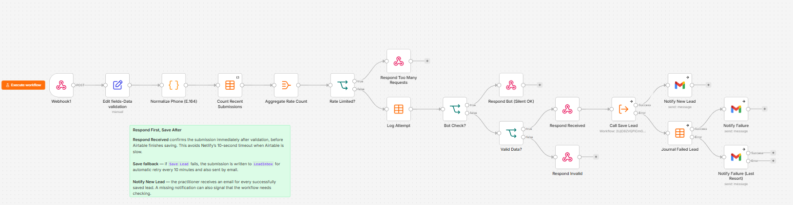

### 1b — Lead Inbox Retry

Runs every 10 minutes over pending journal rows. Success marks the lead
recovered; 12 failed attempts marks it abandoned and emails a person.

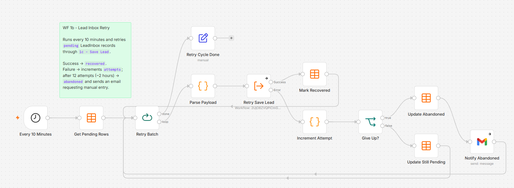

### 1c — Save Lead

The single write point for leads. Matches on phone or email within a 48-hour
window, then updates or creates, and links the lead to an existing client.

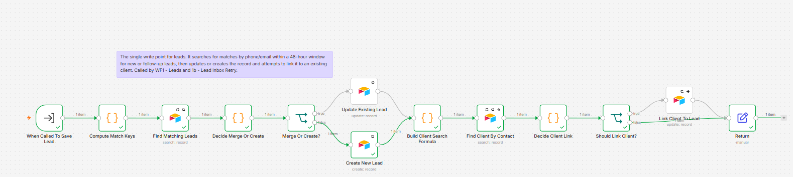

### 4 — Error Handler

Shared error handler. Triggers whenever a linked workflow fails and emails the
workflow name, execution ID, error message, last node executed, and a link to
the failed execution.

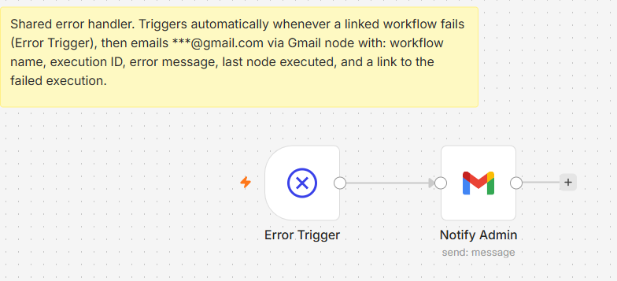

### 5 — Calendar Sync

Three triggers — created, updated, cancelled — normalized into one path.
Google Calendar is always the source of truth for appointment time.

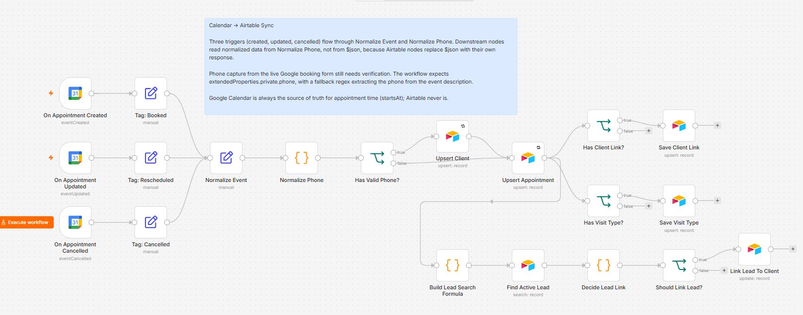

### 6 — App Gateway

The admin app never writes to the CRM directly. Every appointment action goes
through Google Calendar and is written back immediately, so changes appear in
the app without waiting for the next sync cycle.

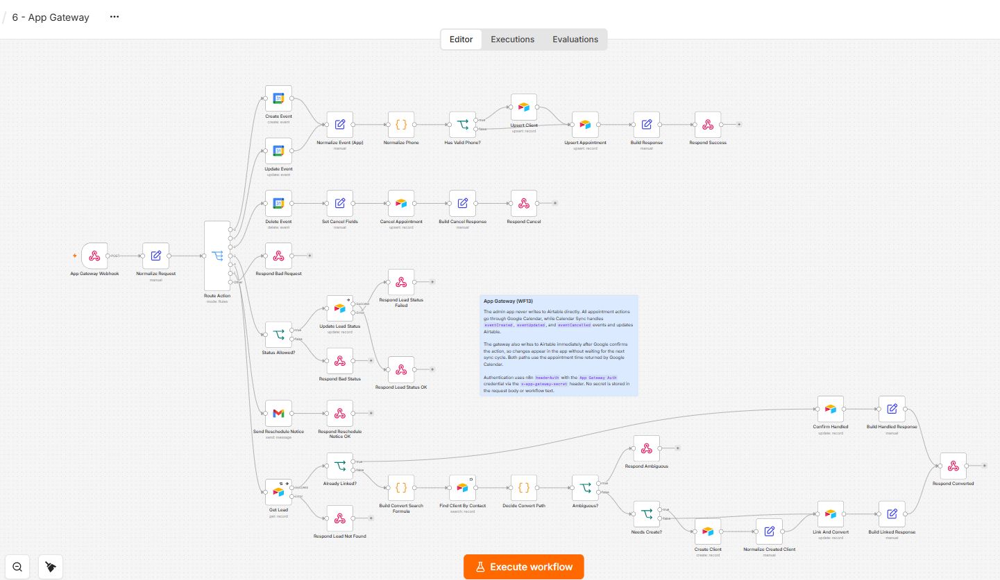

### 7 — Customer Service Chat

RAG over approved clinic content in a vector store. The chatbot cannot create,
change, or cancel appointments — it only provides information and directs users
to booking.

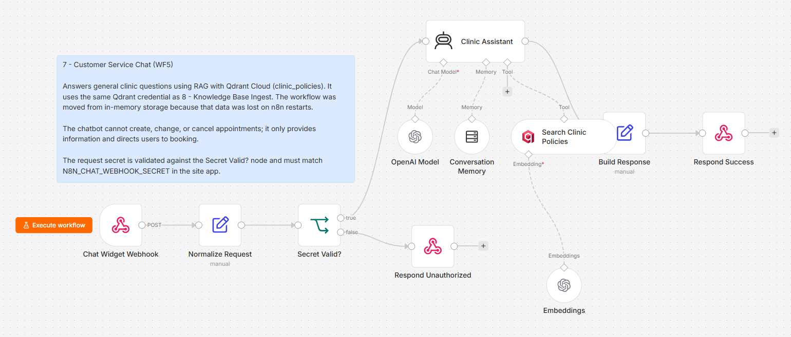

### 8 — Knowledge Base Ingest

Loads the approved clinic knowledge base into the vector store used by workflow
7. Old points are cleared before ingest so re-running never produces duplicate
chunks, and the source of truth stays a reviewed content file, not the workflow.

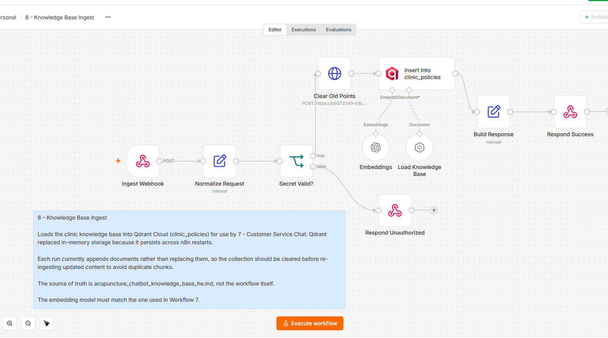

### 9 — Appointment Reminders

Runs daily at 09:00 and finds next-day appointments that are not cancelled and
have no confirmation response yet. Sends an email with three one-time links —
confirm, cancel, or request reschedule — handled by the website.

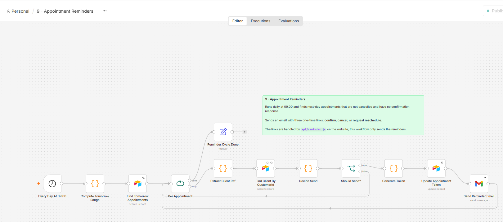

### 10 — Manager Agent

Owner-only Telegram bot. Questions are classified by topic, the relevant CRM
data is retrieved and aggregated by dedicated nodes, and the model receives only
pre-computed JSON — it has no direct tool access.

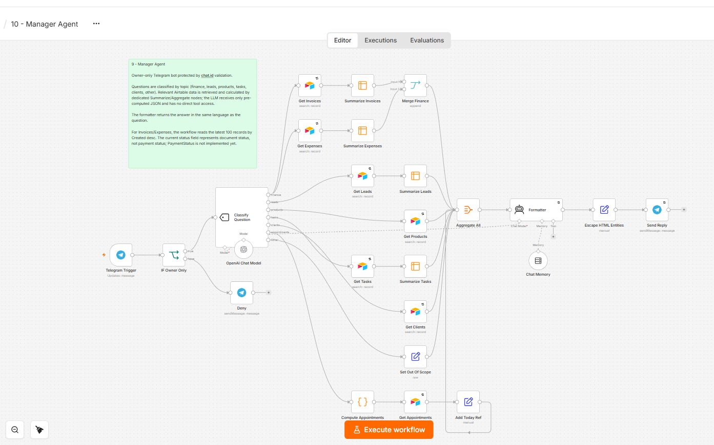

---

## Privacy & Security Note

This is a demo/staging build for a real private acupuncture clinic in Haifa,
created before production deployment. No real patient data is used.
